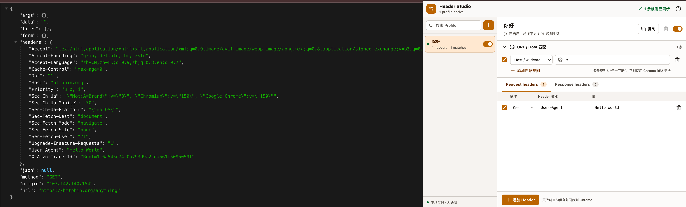

# Header Studio

**中文** · [English](README.en.md)

[GitHub 仓库](https://github.com/Sndav/Header-Studio) · [下载最新版本](https://github.com/Sndav/Header-Studio/releases/latest)

一个隐私优先、完全开源的 Chrome Header 修改工具。通过多个 Profile 修改 Request 和 Response Headers，支持 Host 通配符与 RE2 正则匹配。

**配置留在本地。没有遥测，没有分析 SDK，没有远程代码，也不会把浏览数据发送给任何服务器。**



## 为什么选择 Header Studio

- **隐私优先**：配置只保存在 `chrome.storage.local`，不会离开你的浏览器。
- **零遥测**：不统计安装量、点击、访问站点、规则内容或错误信息。
- **源码可审计**：代码基于 MIT 协议开放，可自行构建和检查最终扩展产物。
- **不注入网页**：不使用 Content Script，不读取或修改页面 DOM。
- **使用 Chrome 原生规则**：Header 修改由 Manifest V3 `declarativeNetRequest` 完成。

## 功能

- 修改 Request 与 Response Headers
- 支持 `Set`、`Append` 和 `Remove`
- 多个 Profile 同时生效，支持单独启用或暂停
- 使用 Host、通配符、完整 URL 或 Chrome RE2 正则匹配
- 输入常见 Header 名称时自动提示
- 中文与英文界面一键切换，语言选择自动保存
- 无效正则和规则同步错误会直接显示在界面中
- WCAG AA 对比度、清晰焦点状态和键盘操作支持

## 安装

### 从 Release 安装

1. 打开 [Releases](https://github.com/Sndav/Header-Studio/releases)。
2. 下载最新的 `header-studio-v*.zip` 并解压。
3. 打开 Chrome，在地址栏进入 `chrome://extensions`。
4. 打开右上角的“开发者模式”。
5. 点击“加载已解压的扩展程序”，选择刚解压的目录。

Release 同时提供使用固定密钥签名的 `.crx` 文件及 SHA-256 校验文件。由于 Chrome Stable 通常会阻止从 Chrome Web Store 之外直接安装 CRX，CRX 更适用于允许离线扩展的 Chromium 或企业策略环境；普通 Chrome 用户应使用上面的 ZIP 安装方式。

### 从源码安装

需要 Node.js 20.19 或更高版本。

```bash
git clone https://github.com/Sndav/Header-Studio.git
cd ModHeader
npm ci
npm run build
```

然后：

1. 打开 Chrome，在地址栏进入 `chrome://extensions`。
2. 打开右上角的“开发者模式”。
3. 点击“加载已解压的扩展程序”。
4. 选择项目中的 `dist/` 目录。
5. 将 Header Studio 固定到浏览器工具栏。

## 如何使用

### 1. 创建 Profile

点击左侧搜索框旁的 `+`。Profile 用来组织一组 URL 匹配条件和 Header 修改规则。多个启用的 Profile 可以同时工作。

### 2. 配置 URL / Host 匹配

每个 Profile 可以添加多条匹配规则，多条规则之间是“或”的关系：

| 输入 | 作用范围 |
| --- | --- |
| `*` | 所有 HTTP 和 HTTPS URL |
| `*.example.com` | `example.com` 及其所有子域名 |
| `api.example.com` | 指定 Host，可使用任意端口 |
| `https://example.com/api/*` | 完整 URL 通配符 |
| `^https://api\.example\.com/` | Chrome RE2 正则表达式 |

正则会在同步规则前交给 Chrome 校验。不支持的 RE2 语法不会覆盖上一组有效规则，界面会显示同步失败原因。

### 3. 添加 Header

选择 `Request headers` 或 `Response headers`，点击“添加 Header”，然后选择操作：

- `Set`：设置 Header；存在同名 Header 时覆盖。
- `Append`：追加值。部分 Header 受 Chrome 的安全限制，Chrome 拒绝时会显示同步错误。
- `Remove`：删除 Header，不需要填写值。

输入 Header 名称时会提示常见名称，也可以输入任意 Chrome 允许的 Header。

### 4. 启用或暂停

- Profile 右侧开关控制整个 Profile。
- 每条匹配规则和 Header 行前的复选框只控制当前规则。
- 顶栏会显示已同步到 Chrome 的动态规则数量。

### 5. 切换语言

点击顶栏的 `EN` / `中文` 按钮即可切换界面语言。语言设置与 Profile 一样保存在本地。

## 隐私与权限

Header Studio 不包含后端服务。扩展的正常运行不需要连接项目作者或任何第三方服务器。

| 权限 | 用途 | 不会做什么 |
| --- | --- | --- |
| `storage` | 在本地保存 Profile、规则和语言 | 不会同步到作者服务器 |
| `declarativeNetRequest` | 让 Chrome 原生修改 Header | 不会读取页面 DOM |
| `<all_urls>` | 让用户创建的规则可以匹配任意站点 | 不会记录或上传浏览历史 |

项目明确不包含：

- 遥测或使用情况分析
- 广告、用户画像或设备指纹
- 远程脚本、动态下载代码或 CDN 依赖
- Content Script 或页面 DOM 访问
- Profile 云同步或账号系统

你可以在 [`public/manifest.json`](public/manifest.json) 检查全部权限，在 [`src/background.ts`](src/background.ts) 检查规则同步逻辑。

## 开发与验证

```bash
npm run typecheck
npm test
npm run build
```

GitHub Actions 会对每次提交和 Pull Request 执行类型检查、测试与生产构建。推送 `v*` 标签时会自动创建 GitHub Release，附带 ZIP、固定密钥签名的 CRX 以及各自的 SHA-256 校验文件。

## 开源协议

Header Studio 使用 [MIT License](LICENSE) 开源。欢迎审计代码、提交 Issue 和 Pull Request，或构建自己的版本。
